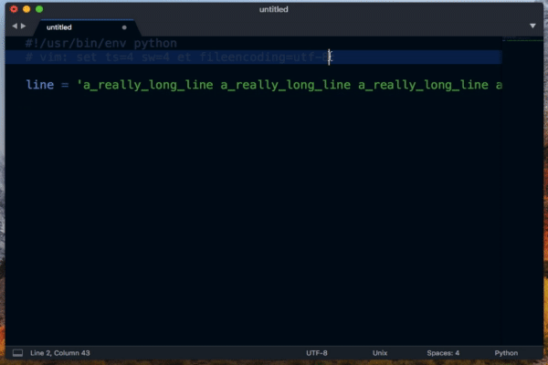
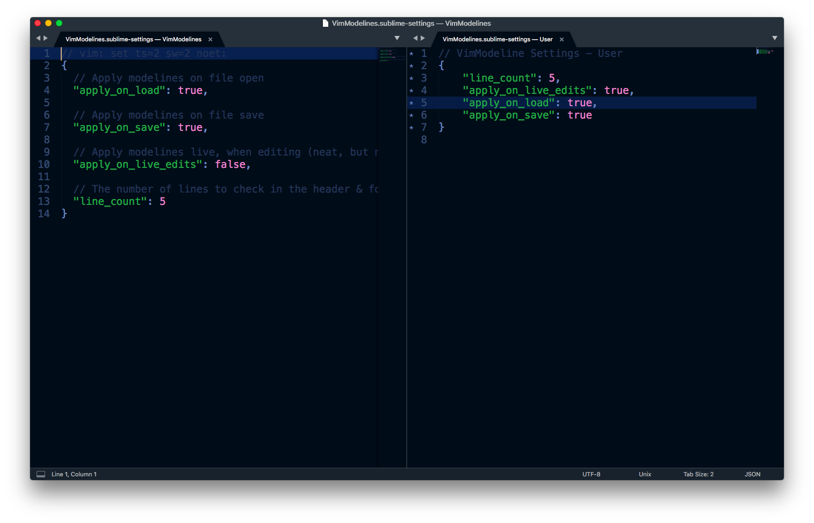

# VimModelines for Sublime Text 3

VimModelines adds [Vim](http://www.vim.org/) modeline support into
[Sublime Text](https://www.sublimetext.com/) 3 for common settings. Modelines
are Vim commands embedded into the comment headers or footers. They are commonly
used to set attributes specific to the file, like indentation or line endings to override the editor's default settings.

They are the Vi/Vim equivalent of [Emacs](https://www.gnu.org/software/emacs/)
modelines.

Their inclusion into files like Makefile, which must be tab delimited, or in
projects with many contributors is common-ish. They are also a common mechanism
for making Python aware of the source encoding.

This plugin, by default, will search for any on file load & save and apply them
to the Sublime Text view.

The default settings for this plugin, for example, uses tabs and has preference
for a width of 2. This will override your default settings if `apply_on_load` is
set to `true`.

## Parsed Attributes

| Attribute          | Description                               | Mapping     |
| ------------------ | ----------------------------------------- | ----------- |
| autoindent, ai     | Automatic indentation           | `auto_indent = True`  |
| noautoindent, noai | Disable automatic indentation   | `auto_indent = False` |
| fileformat, ff     | Set line endings (dos, mac, unix) | `set_line_endings()` |
| tabstop, ts        | # of columns for each tab character       | `tab_size`  |
| shiftwidth, sw     | # of columns for indent operation         | **ignored** |
| softtab, st        | # of columns for tab key (space & tab)    | **ignored** |
| expandtab, et      | Tabs → Spaces      | `translate_tabs_to_spaces = True`  |
| noexpandtab, noet  | Respect tab chars  | `translate_tabs_to_spaces = False` |
| number, nu         | Show line numbers              | `line_numbers = True`  |
| nonumber, nonu     | Hide line numbers              | `line_numbers = False` |
| wrap               | Enable word wrap                  | `word_wrap = True`  |
| nowrap             | Disable word wrap                 | `word_wrap = False` |
